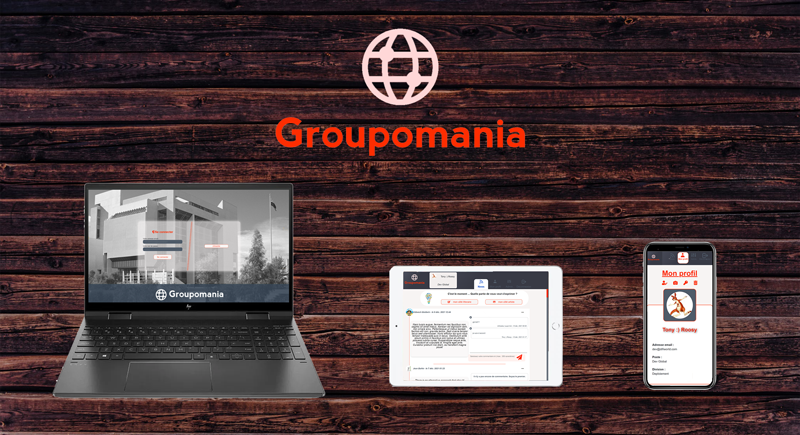

# **Groupomania**  --  *by RoosDev* 

## Project 7 - OpenClassRooms  -- *Create a corporate Social Network*
---



---
## **The Techno.**
---

### **FRONT END** <br />
 with
g
<br />
<br />
<br />

### **BACK END** <br />

 <br />
 <br />

---
## **Install & run**
---

1. Clone the repository

* ### The BACK END
2. Create Database and tables.
   1. Create de Databse in MySQL 
   2. Go in folder : **/DB**
   3. Import in the databse created in MySQL the .sql file
   4. All settings to connect to the Database must be updated in the file  : **/backend/.env**
3. In a Shell :
   1. Go in folder : **/backend**
   2. Run *(to install)* :   <br /> 
    **``` npm install ```**
   3. then run *(to start)*:<br /> 
    **``` node server.js ```**

=> In the Shell you should read  :<br /> 
      *``` Executing (default): SELECT 1+1 AS result```*

* ### The FRONT END
4. In a shell :
   1. Go in folder : **/web**
   2. Run *(to install)* :   <br /> 
    **``` npm install ```**
   3. Assurez-vous que les dossiers suivants sont bien présents dans le répertoire : <br /> 
         - **.\web\public\Public_Images\Profile**
         - **.\web\public\Public_Images\Posts**<br />
      S'ils ne sont pas présent, il faut les créer.
   4. Run *(to start)*:<br /> 
   **``` npm run serve ```**<br /> 
   *(if you want to build the web version to published, you can use : **```npm run build```** )*
    
---
## **Admin**
---

To create the first administrator : 

1. Go on the homepage : http://localhost:8080 
2. Sign Up, like a classic user
3. Go in MySql 
   1. select the Database *groupo_prod*   =>   <br />  **``` use groupo_prod;```**
   2. On the table : *users* 
   3. Change the *role_Id* to 3 on your user record<br /> , to do the update you can use : *(if your user have the id 1)*: <br />
    **```UPDATE users SET role_Id = 3 WHERE id = 1; ```**

---
